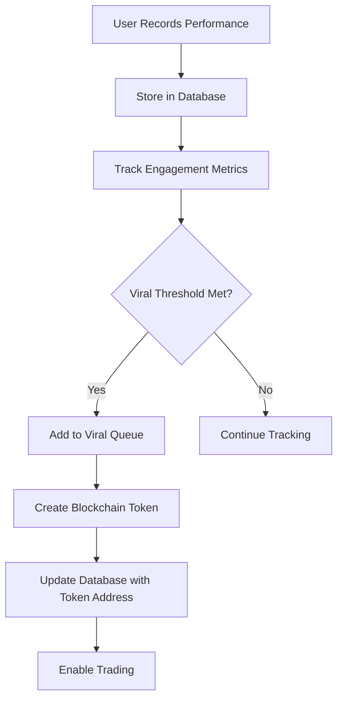

# Database-Blockchain Integration Architecture

## 🏗️ Hybrid Architecture Overview

GigaVibe uses a **hybrid architecture** that combines the best of both centralized database and decentralized blockchain technologies:

```
┌─────────────────────────────────────────────────────────────────┐
│                    GIGAVIBE HYBRID ARCHITECTURE                 │
├─────────────────────────────────────────────────────────────────┤
│                                                                 │
│  ┌─────────────────┐    ┌─────────────────┐    ┌─────────────────┐ │
��  │   FRONTEND      │    │   DATABASE      │    │   BLOCKCHAIN    │ │
│  │   (Next.js)     │    │   (Supabase)    │    │   (Zora/Base)   │ │
│  ├─────────────────┤    ├─────────────────┤    ├─────────────────┤ │
│  │ • User Actions  │◄──►│ • User Profiles │◄──►│ • Token Creation│ │
│  │ • Wallet Conn.  │    │ • Performances  │    │ • Trading       │ │
│  │ • Social Feed   │    │ • Metrics       │    │ • Ownership     │ │
│  │ • Interactions  │    │ • Analytics     │    │ • Transactions  │ │
│  └─────────────────┘    └─────────────────┘    └─────────────────┘ │
│                                                                 │
└─────────────────────────────────────────────────────────────────┘
```

## 🔄 Data Flow Integration

### 1. **Performance Lifecycle**



### 2. **Identity Bridge**

```typescript
// Database stores the bridge between Web2 and Web3 identities
interface User {
  id: UUID;
  wallet_address: string;      // 0x123... (Blockchain identity)
  farcaster_fid: number;       // 12345 (Social identity)
  display_name: string;        // "Artist Name" (Human identity)
}
```

### 3. **Metrics Synchronization**

```typescript
// Off-chain metrics (fast, cheap)
performance_metrics: {
  likes_count: 150,
  shares_count: 45,
  views_count: 1200
}

// Triggers on-chain action when viral
if (metrics.viral_score > threshold) {
  // Create blockchain token
  const token = await zoraService.createPerformanceCoin(performance);
  
  // Store token address in database
  await databaseService.createPerformanceCoin({
    performance_id: performance.id,
    coin_address: token.address
  });
}
```

## 🎯 Why This Hybrid Approach?

### Database Strengths (Supabase)
- ✅ **Fast queries** (< 100ms)
- ✅ **Complex relationships** (JOINs, aggregations)
- ✅ **Real-time subscriptions** (live updates)
- ✅ **Cost effective** (pennies per query)
- ✅ **Rich analytics** (user behavior tracking)

### Blockchain Strengths (Zora/Base)
- ✅ **True ownership** (non-custodial tokens)
- ✅ **Transparent trading** (public market data)
- ✅ **Immutable records** (permanent performance history)
- ✅ **Composability** (DeFi integration)
- ✅ **Decentralized governance** (community control)

## 📊 Data Responsibility Matrix

| Data Type | Database | Blockchain | Reason |
|-----------|----------|------------|---------|
| User Profiles | ✅ Primary | ❌ | Privacy, mutability needed |
| Social Metrics | ✅ Primary | ❌ | High frequency updates |
| Performance Audio | ✅ Primary | ❌ | Large files, cost |
| Viral Detection | ✅ Primary | ❌ | Complex algorithms |
| Token Ownership | ❌ | ✅ Primary | Trust, transparency |
| Trading History | ❌ | ✅ Primary | Immutable records |
| Token Prices | ❌ | ✅ Primary | Market determined |
| Governance Votes | ❌ | ✅ Primary | Decentralized control |

## 🔗 Integration Points

### 1. **Performance → Token Pipeline**

```typescript
// 1. Performance stored in database
const performance = await databaseService.createPerformance({
  farcaster_cast_id: castId,
  user_id: userId,
  audio_url: audioUrl
});

// 2. Metrics tracked in database
await databaseService.updatePerformanceMetrics({
  performance_id: performance.id,
  likes_count: likes,
  shares_count: shares
});

// 3. Viral detection triggers token creation
if (await viralDetectionService.isViral(performance.id)) {
  // 4. Create blockchain token
  const token = await zoraService.createPerformanceCoin(performance);
  
  // 5. Link token to performance in database
  await databaseService.createPerformanceCoin({
    performance_id: performance.id,
    coin_address: token.address,
    initial_price: token.price
  });
}
```

### 2. **Real-time Price Updates**

```typescript
// Blockchain events update database
zoraService.onPriceChange((tokenAddress, newPrice) => {
  databaseService.updateCoinPrice(tokenAddress, newPrice);
});

// Database triggers UI updates
supabase
  .channel('coin-prices')
  .on('postgres_changes', {
    event: 'UPDATE',
    schema: 'public',
    table: 'performance_coins'
  }, (payload) => {
    // Update UI with new price
    updateCoinPrice(payload.new);
  });
```

### 3. **Portfolio Management**

```typescript
// Combine on-chain and off-chain data
async function getUserPortfolio(userAddress: string) {
  // Get token balances from blockchain
  const onChainBalances = await zoraService.getUserBalances(userAddress);
  
  // Get performance data from database
  const performances = await Promise.all(
    onChainBalances.map(balance => 
      databaseService.getPerformanceByTokenAddress(balance.tokenAddress)
    )
  );
  
  // Combine for rich portfolio view
  return onChainBalances.map((balance, i) => ({
    ...balance,           // Token data from blockchain
    ...performances[i]    // Performance data from database
  }));
}
```

## 🚀 Benefits of This Architecture

### 1. **Best User Experience**
- Fast social interactions (database)
- True ownership (blockchain)
- Real-time updates (database subscriptions)
- Transparent markets (blockchain)

### 2. **Cost Optimization**
- Cheap social features (database)
- Expensive operations only when valuable (blockchain)
- Efficient caching strategies
- Minimal gas fees

### 3. **Scalability**
- Database handles high-frequency operations
- Blockchain handles high-value operations
- Independent scaling of each layer
- Graceful degradation

### 4. **Developer Experience**
- Familiar database patterns
- Modern blockchain tooling
- Type-safe interfaces
- Comprehensive error handling

## 🔧 Implementation Details

### Database Schema Design
```sql
-- Core tables
users (wallet_address, farcaster_fid, display_name)
performances (farcaster_cast_id, user_id, audio_url)
performance_metrics (performance_id, likes_count, shares_count)

-- Blockchain integration
performance_coins (performance_id, coin_address, current_price)
viral_queue (performance_id, detection_score, status)

-- Analytics
analytics_events (event_type, user_id, performance_id, event_data)
```

### Blockchain Integration
```typescript
// Zora Protocol Integration
import { createCoin, tradeCoin } from '@zoralabs/coins-sdk';

// Create performance tokens
const token = await createCoin({
  name: `${performance.title} - Reality Check`,
  symbol: generateSymbol(performance.title),
  metadata: generateMetadata(performance)
});

// Enable trading
const trade = await tradeCoin({
  tokenAddress: token.address,
  action: 'buy',
  amount: parseEther('0.1')
});
```

## 📈 Future Enhancements

### 1. **Cross-Chain Support**
- Multi-chain token deployment
- Bridge between networks
- Unified portfolio view

### 2. **Advanced Analytics**
- Predictive viral detection
- Market trend analysis
- User behavior insights

### 3. **DeFi Integration**
- Yield farming with performance tokens
- Liquidity provision rewards
- Governance token distribution

This hybrid architecture provides the **performance of centralized systems** with the **benefits of decentralization**, creating an optimal user experience while maintaining the core values of Web3.